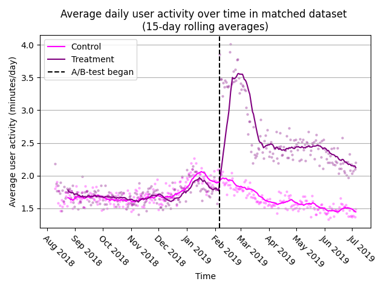
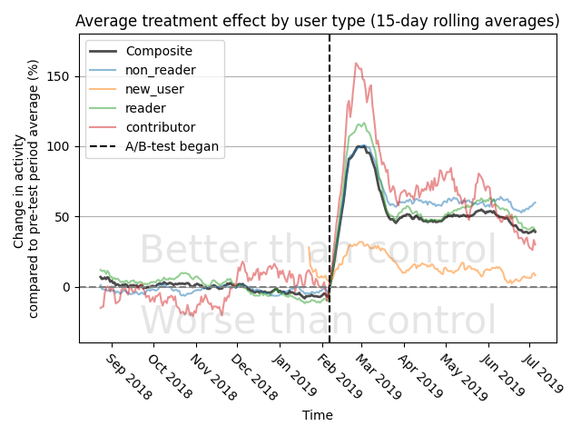
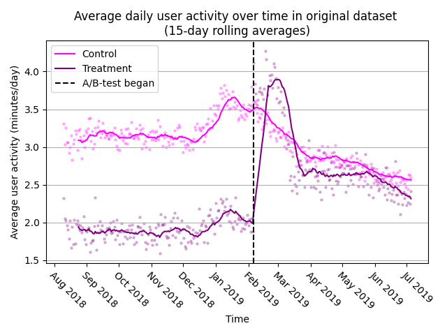
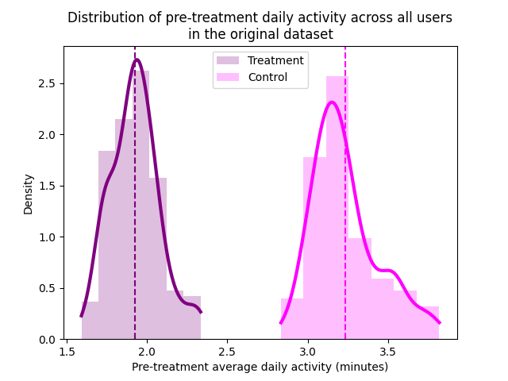

# User Engagement A/B-test Analysis

**Table of Contents**
- [Synopsis](#synopsis)
- [Findings](#findings)
- [Suggested Actions](#suggested-actions)
	- [Deployment](#deployment)
	- [A/B-Testing Protocol](#ab-testing-protocol)
- [Details of the Analysis](#details-of-the-analysis)
	- [Data Preparation](#data-preparation)
	- [Data Analysis](#data-analysis)
		- [Matched DiD T-Test](#matched-did-t-test)
		- [Unmatched DiD T-Test](#unmatched-did-t-test)
		- [Linear Regression](#linear-regression)

## Synopsis

The team has just introduced a new UI design to the app. The goal of the new design is to increase user engagement (measured by minutes spent on site). Using the data of user engagement the team needs understand the impact of the UI change better.

Tables provided are as follows:

1. `t1_user_active_min.csv` records how much time (in minutes) each user spent in the app on any given day:

| uid  | dt         | active_mins |
|------|------------|-------------|
| 0    | 2019-02-22 | 5.0	        |
| 0    | 2019-03-11 | 5.0	        |
| ...  | ...        | ...         |
| 2840 | 2019-06-24 | 4.0         |
| 2840 | 2019-06-25 | 4.0         |

2. `t2_user_variant.csv` Shows which experimental group each user has been assigned to (0 for control group, 1 for treatment group):

| uid   | variant_number | dt         | signup_date |
|-------|----------------|------------|-------------|
| 0     | 0              | 2019-02-06 | 2018-09-24  | 
| 1     | 0              | 2019-02-06 | 2016-11-07  | 
| ...   | ...            | ...        | ...         |
| 49998 | 1              | 2019-02-06 | 2016-04-05  | 
| 49999 | 1              | 2019-02-06 | 2015-12-29  | 

3. `t3_user_active_min_pre.csv` shows historic user engagement (similar to `t1_user_active_min.csv` but before the beginning of the experiment):

| uid  | dt         | active_mins |
|------|------------|-------------|
| 0    | 2018-09-24 | 3.0         |
| 0    | 2018-11-08 | 4.0         |
| ...  | ...        | ...         |
| 2573 | 2018-10-14 | 3.0         |
| 2573 | 2018-10-17 | 1.0         |

4. `t4_user_attributes.csv` shows two attributes of each user: gender (male, female, unknown) and the user type (non_reader, reader, new_user, contributor):

| uid   | gender | user_type  |
|-------|--------|------------|
| 0     | male   | non_reader |
| 1     | male   | reader     |
| ...   | ...    | ...        |
| 49998 | male   | non_reader |
| 49999 | female | non_reader |


## Findings

1. The new feature **increases** user activity by **~65%**, on average, which is retained for **at least five months** after deployment (not yet tested for longer). 



2. Contributors are most impacted (72%), while new users are least impacted (13%).



3. The A/B-testing protocol seems to produce non-random treatment assignments which may bias future experiments. 





## Suggested Actions

### Deployment

1. Keep conducting the experiment for up to a year to see whether the increased user activity vanes or reverses, and if it doesn't, deploy to production. This is preferred if the feature introduces a substantial change to the website, and it will be difficult to retract or change it.
Or
2. Deploy to production. This is preferred when the feature doesn't substantially change the website's functionality and thus would be easy to retract at any time without a noticeable impact on user activity or reputation.

### A/B-Testing Protocol 

3. Revise the randomization method of the A/B-test to ensure that assignment to treatment is truly random. The data of the experimental groups were imbalanced (e.g., vastly different pre-treatment activity), so, unless that was intentional, treatment was likely not randomly assigned, which may negatively impact future A/B-tests.

## Details of the Analysis

### Data Preparation 

A few samples have been dropped due to missing or invalid data (e.g., activity of more than 1,440 minutes per day) reducing the sample size from 50,000 to 49,850
The covariates were unbalanced between the control and the treatment groups (vastly different average activity in pre-test periods, slightly different proportions of gender and user types). If unaccounted for, they could have biased the result, so a matching procedure was conducted to pair each participant in the treatment group to a participant in the control group which (1) had signup date and pre-treatment scores within 0.25 standard deviations, (2) had the exact same gender and user type. As a result of some samples not having a pair, the sample size was reduced from 49,850 to 39,852.

### Data Analysis

Two methods were used to verify the robustness of the result: 
1. Difference-in-differences t-test (matched and unmatched dataset) 
2. Linear regression (matched and unmatched dataset) 
The significance level was set to 0.01, thereby applying the Bonferroni correction to the standard 0.05 level due to several significance tests being performed.

#### Matched DiD T-Test

The test unit of the (paired) t-test with the matched dataset was the treatment effect of a particular matched pair of individuals (), which is calculated as follows: 

Where:
-  - average daily activity of the th treatment user since the beginning of treatment (after the feature was deployed), 
-  - average daily activity of the th treatment user before the beginning of treatment, 
-  - average daily activity of the th control user (matched with the th treatment user) since the beginning of treatment
-  - average daily activity of the th control user before the beginning of treatment
The average treatment effect (ATE) is then simply the average of all , i.e., , where  - the number of pairs (19,926). Statistical significance was determined through a single-sample t-test of whether the mean of the distribution of  is different from zero (with the null hypothesis being that its mean is zero, i.e., no effect on average). The results of the t-test are presented below:
```matlab
	Paired t-test
t = 20.414, df = 19850, p-value < 2.2e-16
alternative hypothesis: true difference in means is not equal to 0
95 percent confidence interval:
 0.9018205 1.0933904
sample estimates:
mean of the differences 
              0.9976055
```
So, the t-test on matched dataset shows a statistically significant () average treatment effect of  minute ( seconds) change in daily activity, i.e., on average, the change in activity the treatment group experienced after the treatment was deployed to them was on average 1 minutes greater than the change the control group experienced over the same time. Since the average daily user activity before treatment was 1.58 minutes per day (in both control and treatment groups), this change is equivalent to a 65% increase in activity (compared to 1.7% increase in the control group). 

| User Type \ Gender | female | male    | unknown | Average |
| ------------------- | ------ | ------- | ------- | ------- |
| contributor         | 7.93** | 10.12** | 10.69   | 9.84**  |
| reader              | 3.55** | 5.0**   | 4.09**  | 4.49**  |
| non_reader          | 0.36** | 0.47**  | 0.32**  | 0.42**  |
| new_user            | 0.11   | 0.13    | 0.03    | 0.1     |
| Average             | 0.75** | 1.19**  | 0.79**  | 1.0**   |

***Table 1.* Estimated Treatmen Effect of the new feature by user type (matched dataset); \* - ; \*\* - **

#### Unmatched DiD T-Test 

To make sure that the matching procedure did not bias the result, an unmatched t-test was conducted on the entire (cleaned) dataset (n=49,850). In this case, the two sample groups were: 


Where  - difference between the average daily activity of the treatment user after treatment began compared to before treatment began.
 - difference between the average daily activity of the th control user after treatment began compared to before treatment began;
Then, a t-test was conducted to whether  was on average statistically significantly different from .  Results of the t-test are presented below.
```matlab
	Welch Two Sample t-test
t = 15.52, df = 13792, p-value < 2.2e-16
alternative hypothesis: true difference in means is not equal to 0
95 percent confidence interval:
 1.006700 1.297742
sample estimates:
  mean of x   mean of y 
 1.06758963 -0.08463093 
```
So, the unmatched t-test also shows a statistically significant () difference between the two groups of 1.15 minutes which agrees with the previous result.

| UserType\Gender | female | male   | unknown | Average |
| ---------------- | ------ | ------ | ------- | ------- |
| contributor      | 12.43* | 10.79* | 15.97*  | 11.68** |
| reader           | 4.47** | 5.59** | 5.74**  | 5.28**  |
| non_reader       | 0.40** | 0.51** | 0.31**  | 0.45**  |
| new_user         | 0.05   | 0.07   | 0.30    | 0.11    |
| Average          | 0.95** | 1.27** | 1.13**  | 1.15**  |

***Table 2.* Estimated Treatmen Effect of the new feature by user type (unmatched dataset).; \* - ; \*\* - **

#### Linear Regression

An ordinary least squares linear regression was also used to 
In the model, the outcome variable - the difference between pre- and post-treatment average daily activity - regresses on each of the covariates including signup date, pre-treatment average activity, gender, and user type, thus controlling for them, and the variant number (1 if the user was assigned to treatment, 0 otherwise). The treatment effect is then the coeffecient near variant number.
The linear regressions over both matched and unmatched dataset confirm the treatment effect of 1 and 1.13 minutes respectively.

| variable              | coef       | std err   | t          | p-value   | \[0.025   | 0.975\]   |
| --------------------- | ---------- | --------- | ---------- | --------- | --------- | --------- |
| intercept             | 0.7621     | 0.091     | 8.392      | 0.000     | 0.584     | 0.940     |
| signup_date_int       | -0.0054    | 0.003     | -2.071     | 0.038     | -0.010    | -0.000    |
| **variant_number**    | **0.9994** | **0.048** | **20.813** | **0.000** | **0.905** | **1.094** |
| pre                   | 0.1125     | 0.006     | 19.716     | 0.000     | 0.101     | 0.124     |
| gender_female         | 0.2207     | 0.049     | 4.526      | 0.000     | 0.125     | 0.316     |
| gender_male           | 0.3612     | 0.040     | 8.943      | 0.000     | 0.282     | 0.440     |
| gender_unknown        | 0.1801     | 0.057     | 3.174      | 0.002     | 0.069     | 0.291     |
| user_type_contributor | 3.0392     | 0.190     | 15.959     | 0.000     | 2.666     | 3.412     |
| user_type_new_user    | -1.9295    | 0.088     | -22.017    | 0.000     | -2.101    | -1.758    |
| user_type_non_reader  | -1.1632    | 0.063     | -18.437    | 0.000     | -1.287    | -1.040    |
| user_type_reader      | 0.8155     | 0.075     | 10.828     | 0.000     | 0.668     | 0.963     |

***Table 3.* Results of the OLS linear regression; the treatment effect is bolded (matched dataset).**

| variable              | coef       | std err   | t          | p-value | \[0.025   | 0.975\]   |
| --------------------- | ---------- | --------- | ---------- | ------- | --------- | --------- |
| intercept             | 1.1797     | 0.092     | 12.792     | 0.000   | 0.999     | 1.360     |
| signup_date_int       | -0.0098    | 0.003     | -3.516     | 0.000   | -0.015    | -0.004    |
| **variant_number**    | **1.1314** | **0.066** | **17.195** | 0.000   | **1.002** | **1.260** |
| pre                   | -0.1546    | 0.003     | -50.480    | 0.000   | -0.161    | -0.149    |
| gender_female         | 0.3420     | 0.052     | 6.564      | 0.000   | 0.240     | 0.444     |
| gender_male           | 0.6265     | 0.042     | 14.782     | 0.000   | 0.543     | 0.710     |
| gender_unknown        | 0.2112     | 0.061     | 3.447      | 0.001   | 0.091     | 0.331     |
| user_type_contributor | 3.3783     | 0.158     | 21.353     | 0.000   | 3.068     | 3.688     |
| user_type_new_user    | -1.8832    | 0.093     | -20.176    | 0.000   | -2.066    | -1.700    |
| user_type_non_reader  | -1.2757    | 0.058     | -21.935    | 0.000   | -1.390    | -1.162    |
| user_type_reader      | 0.9602     | 0.068     | 14.129     | 0.000   | 0.827     | 1.093     |

***Table 4.* Results of the OLS linear regression; the treatment effect is bolded (unmatched dataset).**
